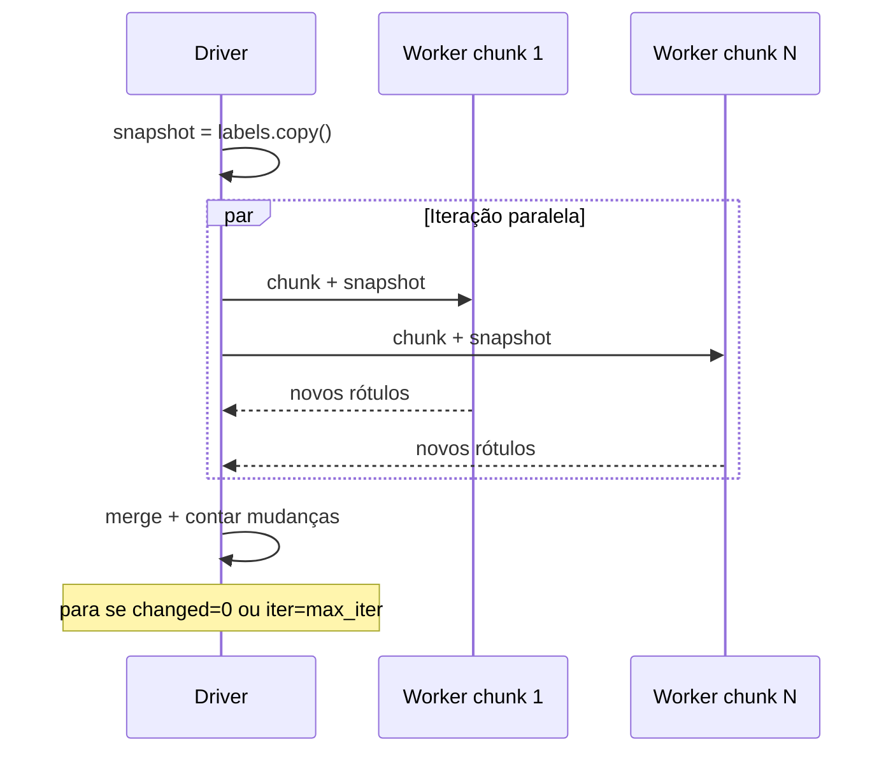

<div align="center">

# Distributed Label Propagation

**Detecção de comunidades em grafos massivos — Ray vs Dask**

Python 3.11 · Numba · Ray Core · Dask Distributed · Docker

[Documentação completa](docs/DOCUMENTACAO_PROJETO.md) · [Resultados](results/REPORT.md) · [SNAP soc-Orkut](https://snap.stanford.edu/data/com-Orkut.html)

</div>

---

## O problema

Redes sociais como o **Orkut** são grafos com **milhões de nós** e **centenas de milhões de ligações**. Uma pergunta central em Big Data e análise de redes:

> **Quem está naturalmente agrupado com quem?**  
> Ou seja: encontrar **comunidades** — conjuntos de nós densamente conectados entre si e pouco conectados ao resto.

<p align="center">
  
</p>

| Desafio | Escala Orkut (100%) |
|---------|---------------------|
| Nós | ~3,07 milhões |
| Arestas (SNAP, undirected) | ~117 milhões |
| Arcos no CSR (simetrizado) | ~234 milhões |
| RAM do grafo | ~1 GB só de CSR + overhead |

Algoritmos **sequenciais** em memória tornam-se lentos; daí **paralelizar** o loop do algoritmo com **Ray** ou **Dask** na mesma máquina, medindo tempo, memória e qualidade da partição.

---

## A ideia: Label Propagation (LPA)

O **Label Propagation** (Raghavan et al., 2007) detecta comunidades só com a topologia do grafo — sem fixar *K* nem optimizar uma função global:

1. Cada nó começa com um **rótulo único** (no nosso código: derivado do `node_id`, com permutação por `seed`).
2. A cada **iteração**, cada nó adopta o rótulo **mais frequente entre os vizinhos** (empate → menor rótulo).
3. Repete até **ninguém mudar** ou atingir `max_iter` (default **100**).

Grupos densamente ligados convergem rapidamente para o mesmo rótulo; regiões esparsas separam comunidades. A actualização é **síncrona** (snapshot no início da iteração) para comparar Ray e Dask de forma justa.

<p align="center">
  
  <br/>
  <sub>Adaptado de <a href="https://neo4j.com/blog/graph-data-science/graph-algorithms-neo4j-label-propagation/">Neo4j — Label Propagation</a> (Raghavan et al., 2007).</sub>
</p>

**Qualidade final:** modularidade **Q** (Blondel et al., 2008) sobre a partição obtida.



---

## O que este projeto faz

Implementa **o mesmo algoritmo LPA** duas vezes — só muda o **runtime distribuído**:

| | **Ray** | **Dask** |
|---|---------|----------|
| Modelo | `ray.put` + `@ray.remote` | `client.scatter` + `client.submit` |
| Workers | 1 processo / CPU (auto) | `LocalCluster`, 1 thread/worker |
| Núcleo comum | `lpa_core` + kernel **Numba** | idem |
| Grafo | Mesmo CSR em memória | idem |

<p align="center">
  
</p>

**Não é** um cluster multi-VM por default: tudo corre numa **única VM** (ideal para o trabalho académico e para Docker). O benchmark grava CSV, logs por iteração, partições JSON e relatório Markdown.

---

## Sumário

| Secção | Conteúdo |
|--------|----------|
| [Resultados](#resultados-ray-vs-dask-orkut-100) | Benchmark condensado + gráficos |
| [Início rápido](#início-rápido) | PC (0,1%) vs VM (100%) |
| [Dataset](#dataset-soc-orkut) | Orkut, undirected, download |
| [Configuração](#configuração) | YAML e env vars |
| [Saídas](#saídas-do-benchmark) | CSV, logs, métricas de memória |
| [Docker](#docker) | Pipeline automatizado |
| [CLI](#cli) | Comandos |
| [Testes & QA](#testes-e-qa) | pytest, make qa |
| [Estrutura](#estrutura-do-repositório) | Pastas do código |
| [FAQ](#problemas-comuns) | OOM, shm, permissions |

Documentação técnica detalhada: **[docs/DOCUMENTACAO_PROJETO.md](docs/DOCUMENTACAO_PROJETO.md)** · Relatório completo: **[results/REPORT.md](results/REPORT.md)**

---

## Resultados (Ray vs Dask, Orkut 100%)

Campanha **`20260622T005654`** — VM Docker, **6 vCPUs**, **~16 GB RAM**, **3,07M nós**, **100 iter LPA**, seeds 42/43/44. Artefactos em [`results/reports/`](results/reports/); figuras em [`results/figures/`](results/figures/).

### Resumo

| Métrica | Ray (3/3) | Dask (3/3*) | Ray / Dask |
|---------|-----------|-------------|------------|
| Tempo algoritmo (média) | **649 s** ± 13 | 1298 s ± 36 | **~2,0×** |
| Throughput | **4704 nós/s** | 2368 nós/s | **~2,0×** |
| RSS pico (`peak_process_tree_rss_mb`) | **10,9 GB** | 12,0 GB | ~10% menos |
| Comunidades | 590 | 590 | **idênticas** |

\* **Dask run 1 (seed 42)** completou numa **execução isolada** (`20260622T030138`, 1333 s). Na campanha mista Ray→Dask (`005654`), a run 1 falhou por **OOM** — houve **2 falhas** no total (também `024351`). Runs 2–3 do Dask vêm da campanha principal.

**Partição:** Ray e Dask produzem a **mesma distribuição de comunidades** quando terminam — comparação de **runtime**, não de algoritmo diferente.

### Tempos por run

| Run | Seed | Ray algo | Dask algo | Notas |
|-----|------|----------|-----------|-------|
| 1 | 42 | 667 s | 1333 s* | *Dask: run isolada; mista falhou OOM |
| 2 | 43 | 637 s | 1313 s | |
| 3 | 44 | 642 s | 1249 s | |

Carga do grafo ~362 s (cache quente). Ray ~**6,4 s/iter**; Dask ~**12,5 s/iter**.

### Clusterização (590 comunidades)

Duas mega-comunidades cobrem ~91% dos nós; `converged=false` em 100 iter (normal no Orkut).

<p align="center">
  
</p>

Regenerar figuras: `python scripts/generate_results_report.py` · Detalhe: **[results/REPORT.md](results/REPORT.md)** · **[§11 docs](docs/DOCUMENTACAO_PROJETO.md#11-benchmark-e-relatórios)**

---

## Início rápido

### PC / laptop — benchmark em ~1 min (fixture 0,1%)

Grafo pequeno **já no repo** — não precisa baixar o Orkut.

```bash
git clone <repo-url> big-data && cd big-data
python3.11 -m venv .venv && source .venv/bin/activate
pip install -e ".[dev]"

# opcional: copiar fixture para data/raw/
mkdir -p data/raw
cp tests/integration/fixtures/orkut_0p1pct.npz data/raw/

python -m cli.main benchmark \
  --input data/raw/orkut_0p1pct.npz \
  --fractions 0.1 --runs 1

python -m cli.main report
```

| Fixture | Nós | Arcos | Nota |
|---------|-----|-------|------|
| `tests/integration/fixtures/orkut_0p1pct.npz` | 1.632 | ~9.774 | Sintético (smoke test). Com raw Orkut, `build_integration_fixture.sh` gera amostra real. |

### VM — Orkut 100% (produção)

```bash
mkdir -p data/raw reports
sudo chown -R 1000:1000 data reports

docker compose up --build -d
docker compose logs -f
```

Requisitos: **16+ GB RAM**, **~15–20 GB disco**. Carga ~6 min; Ray ~11 min/run; Dask ~20 min/run.

**Só Dask, 1 run, seed 42:**

```bash
docker compose run --rm \
  -e BENCHMARK_BACKEND=dask \
  -e BENCHMARK_RUNS=1 \
  -e BENCHMARK_SEEDS=42 \
  lpa
```

---

## Dataset soc-Orkut

| | |
|---|---|
| **Fonte** | [SNAP com-Orkut](https://snap.stanford.edu/data/com-Orkut.html) |
| **Ficheiro local** | `data/raw/soc-orkut-relationships.txt` |
| **Download** | `bash scripts/download_dataset.sh` |
| **Tipo** | Não direcionado — cada aresta `u v` vira `u→v` e `v→u` na carga |
| **Formato interno** | out-CSR (`numpy`), voting com kernel Numba |

```bash
# URL real: bigdata/communities/com-orkut.ungraph.txt.gz
bash scripts/download_dataset.sh
```

---

## Configuração

Copiar `config.yaml.example` → `config.yaml` ou usar variáveis de ambiente.

| Chave / env | Default | Descrição |
|-------------|---------|-----------|
| `graph_raw_path` | `data/raw/soc-orkut-relationships.txt` | SNAP ou `.npz` |
| `dataset_slug` | `orkut` | Prefixo nos artefactos |
| `lpa_max_iter` / `LPA_MAX_ITER` | `100` | Teto de iterações |
| `graph_directed` | `false` | `false` = undirected |
| `lpa_chunk_divisor` / `LPA_WORKERS` | auto (CPUs) | Chunks = workers |
| `BENCHMARK_BACKEND` | `both` | `ray`, `dask`, `both` |
| `BENCHMARK_RUNS` | `3` | Repetições |
| `BENCHMARK_SEEDS` | `42,43,44` | Seeds LPA por run |

---

## Saídas do benchmark

Cada execução gera um **stamp** UTC (ex. `20260622T005654`):

```
reports/
├── metrics_raw_<stamp>.csv      # tempos, memória, comunidades
├── benchmark_run_<stamp>.log    # log por iteração [ray][iter=N]
├── comparison_<stamp>.md        # relatório Ray vs Dask
└── partitions_<stamp>/
    ├── ray_orkut_100p0pct_run1.communities.json
    └── dask_orkut_100p0pct_run1.communities.json
```

### Métricas de memória (o que usar no relatório)

| Coluna CSV | Significado |
|------------|-------------|
| `peak_process_tree_rss_mb` | **Pico total na VM** (driver + workers somados) |
| `peak_driver_rss_mb` | Só o processo Python principal |
| `peak_memory_mb` | Heap tracemalloc (referência; subestima) |
| `throughput_nodes_per_s` | nós / tempo de algoritmo |

No log, `[ray][vm-peaks] host=1299MB` é o **maior worker** — não o total. Preferir `peak_process_tree_rss_mb` no CSV.

---

## Docker

O **entrypoint** (`scripts/docker-entrypoint.sh`) corre o pipeline e **termina** — `docker compose ps -a` com `Exited (0)` é sucesso.

```bash
docker compose up --build -d    # detached
docker compose logs -f
docker compose down
```

| Variável | Default |
|----------|---------|
| `BENCHMARK_FRACTIONS` | `100` |
| `BENCHMARK_RUNS` | `3` |
| `BENCHMARK_BACKEND` | `both` |
| `LPA_MAX_ITER` | `100` |

Melhorias recomendadas no `docker-compose.yml`:

```yaml
services:
  lpa:
    shm_size: 4gb    # Ray object store (default Docker = 64 MB)
```

Se Dask falhar por RAM na 1ª run: `-e LPA_WORKERS=4`.

---

## CLI

```bash
python -m cli.main --help

# Campanha completa
python -m cli.main benchmark --input data/raw/soc-orkut-relationships.txt --fractions 100 --runs 3

# Um backend
python -m cli.main benchmark --input <path> --ray-only --runs 1
python -m cli.main benchmark --input <path> --dask-only --runs 1

# LPA avulso (JSON no terminal; não grava CSV)
python -m cli.main lpa-ray  --input <path> --seed 42 --max-iter 100
python -m cli.main lpa-dask --input <path> --seed 42 --max-iter 100

# Relatório
python -m cli.main report --input-csv reports/metrics_raw_<stamp>.csv
```

---

## Testes e QA

```bash
pytest tests/unit/ -v
pytest tests/integration/test_lpa_orkut.py -m integration -v -s

make qa          # ruff, pylint, bandit, coverage, mutmut
make qa-check    # lint rápido
```

---

## Estrutura do repositório

```text
big-data/
├── docs/
│   ├── DOCUMENTACAO_PROJETO.md   # doc técnica longa
│   └── assets/                   # diagramas (SVG)
├── src/
│   ├── lpa_core/                 # LPA + Numba
│   ├── graph/                    # CSR, modularidade Q
│   ├── ray_impl/  dask_impl/
│   ├── preprocessing/            # SNAP → CSR, .npz
│   ├── benchmark/                # runner, report
│   └── cli/
├── tests/integration/fixtures/orkut_0p1pct.npz
├── data/raw/                     # Orkut (gitignored)
├── reports/                      # saídas do benchmark (gitignored)
├── results/                      # relatório + figuras (campanha arquivada)
├── docker-compose.yml
└── config.yaml.example
```

---

## Problemas comuns

| Sintoma | Causa provável | Solução |
|---------|----------------|---------|
| `permission denied` em `data/` | uid container 1000 | `sudo chown -R 1000:1000 data reports` |
| Download 404 | URL SNAP antiga | `git pull` + `download_dataset.sh` actualizado |
| Ray `/dev/shm` warning | Docker 64 MB | `shm_size: 4gb` |
| Dask `already forgotten` | Worker OOM (95% RAM) | VM limpa; `LPA_WORKERS=4` |
| `converged=false` | Orkut grande | Normal com 100 iter; comunidades estáveis |
| Container parado | Pipeline concluiu | Ver `reports/` |

---

## Referências

1. Raghavan, U. N., Albert, R., & Kumara, S. (2007). Near linear time algorithm to detect community structures in large-scale networks. *Physical Review E*, 76(3), 036106.
2. Blondel, V. D. et al. (2008). Fast unfolding of communities in large networks. *J. Stat. Mech.* P10008.
3. [Stanford SNAP — soc-Orkut](https://snap.stanford.edu/data/com-Orkut.html)

---

<div align="center">

**Big Data · Label Propagation · Ray vs Dask**

</div>
