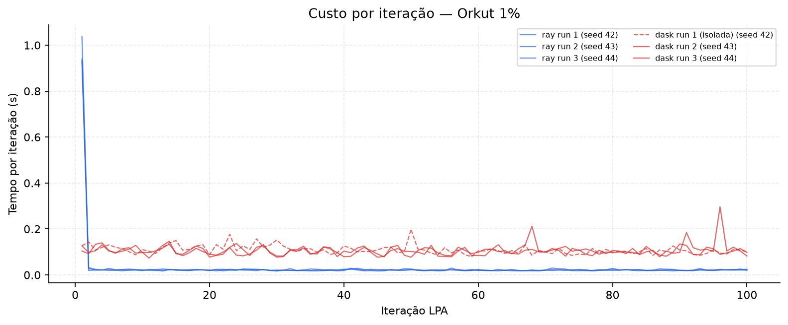
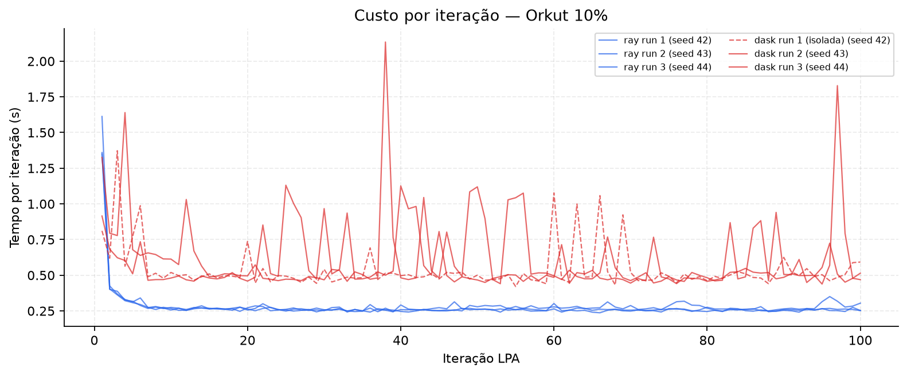

# Relatório geral

Comparação de **Label Propagation (LPA)** distribuído com **Ray** e **Dask** no grafo **soc-Orkut** (SNAP). Workers fixos: **6**. LPA síncrono, até **100 iterações**, seeds **42/43/44** (3 runs por configuração).

**Conteúdo:** Orkut **100%** (3M nós, VM Docker) + escalabilidade **1%** e **10%** (amostra BFS).

---

# Parte I — Orkut 100%

**Nós:** 3 072 441 · **Workers:** 6 · **VM Docker**, 6 vCPUs, ~16 GB RAM

## Resumo executivo

| Métrica | Ray (3/3) | Dask (3/3*) | Ray / Dask |
|---------|-----------|-------------|------------|
| Tempo algo (média) | **648,8 s** ± 13,3 | 1298 s ± 36 | **~2,0×** |
| Throughput | **4704 n/s** ± 96 | 2368 n/s ± 67 | **~2,0×** |
| RSS pico total | **10,9 GB** ± 0,1 | 11,7 GB ± 0,1 | ~7% menos |
| Comunidades | 590 | 590 | idênticas |

\* Dask run 1 (seed 42): uma execução isolada completou (1333 s); na campanha mista Ray→Dask, run 1 falhou por OOM em duas tentativas.

## Algoritmo e pipeline


1. Carga SNAP → CSR simétrico (~234M arcos).
2. Particionamento em 6 chunks.
3. LPA síncrono: snapshot + merge por iteração.
4. Métricas: tempo/iter, RSS process tree, throughput.

## Desempenho 100%

| Run | Seed | Backend | Algo (s) | Throughput | RSS pico |
|-----|------|---------|----------|------------|----------|
| 1 | 42 | Ray | 667,4 | 4604 n/s | 11,1 GB |
| 2 | 43 | Ray | 637,4 | 4820 n/s | 10,8 GB |
| 3 | 44 | Ray | 641,6 | 4789 n/s | 10,8 GB |
| 1 | 42 | Dask | 1333,4* | 2304 n/s | 11,9 GB |
| 2 | 43 | Dask | 1313,1 | 2340 n/s | 11,9 GB |
| 3 | 44 | Dask | 1248,6 | 2461 n/s | 12,0 GB |


## Clusterização (100%)

590 comunidades; duas mega-comunidades ~91% dos nós. `converged=false` em 100 iter (esperado nesta escala).

---

# Parte II — Escalabilidade 1% e 10%

**Workers:** 6 · **Runs:** 3 · **Amostra:** BFS (tempo de amostragem excluído do tempo de algoritmo)

## Desempenho (média ± desvio)

| Backend | Fração | Tempo algo (s) | Throughput (n/s) | RSS total (MB) | Comunidades |
|---------|--------|----------------|------------------|----------------|-------------|
| Ray | 1% | 3,09 ± 0,08 | 9962 ± 258 | 2224 ± 9 | 80 |
| Dask | 1% | 10,66 ± 0,23 | 2884 ± 61 | 1700 ± 28 | 80 |
| Ray | 10% | 27,92 ± 0,43 | 11008 ± 171 | 3018 ± 43 | 66 |
| Dask | 10% | 57,51 ± 3,21 | 5359 ± 296 | 2085 ± 77 | 66 |

## Gráficos 1%




```{=latex}
\clearpage
```

## Gráficos 10%


{ width=88% }

## Throughput por fração (6 workers)

| Fração | Ray (n/s) | Dask (n/s) |
|--------|-----------|------------|
| 1% | 9962 | 2884 |
| 10% | 11008 | 5359 |
| 100% | 4704 | 2368 |

Ray mantém vantagem ~2–3,5× em todas as frações testadas.

---

# Conclusões

1. **Ray** ~2× mais rápido no Orkut completo, com menor pressão de memória na campanha mista.
2. **Partições equivalentes** entre Ray e Dask (mesmo algoritmo síncrono).
3. **Escalabilidade:** 1% e 10% confirmam o padrão; amostra BFS permite medir LPA sem re-scan do SNAP a cada run.
4. **Seeds 42/43/44:** variabilidade temporal, não algorítmica (partições idênticas).

---

# Referências

1. Raghavan et al. (2007). *Phys. Rev. E* 76, 036106.
2. Leskovec & Krevl (2014). SNAP — soc-Orkut.
3. Moritz et al. (2018). Ray. OSDI 2018.
4. Rocklin (2015). Dask. SciPy 2015.
