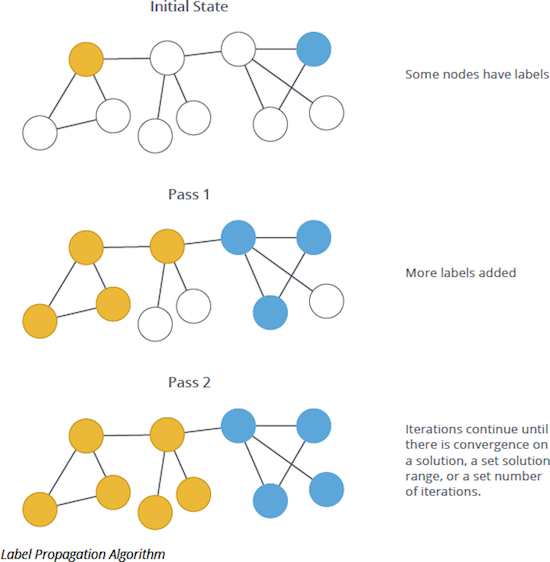

# Relatório de benchmark: Label Propagation distribuído (Ray vs Dask)

**Dataset:** soc-Orkut (SNAP, grafo não direcionado simetrizado)  
**Campanha principal:** `20260622T005654`  
**Nós:** 3 072 441 | **Iterações LPA:** 100 (máximo) | **Workers:** 6 (`lpa_chunk_divisor=6`)  
**Data dos testes:** 21–22 jun 2026

---

## 1. Resumo executivo

Comparamos duas implementações distribuídas de **Label Propagation (LPA)** sobre o grafo Orkut completo, numa VM Docker com **6 vCPUs** e cerca de **16 GB RAM**.

| Métrica | Ray (3/3) | Dask (3/3*) | Razão Ray/Dask |
|---------|-----------|-------------|----------------|
| Tempo médio do algoritmo | **648,8 s** ± 13,3 | 1298 s ± 36 | **~2,0× mais rápido** |
| Throughput médio | **4704 nós/s** ± 96 | 2368 nós/s ± 67 | **~2,0×** |
| RSS total pico (driver+workers) | **10,9 GB** ± 0,1 | 11,7 GB ± 0,1 | **~7% menos RAM** |
| Comunidades finais | 590 | 590 | **idênticas** |

\* **Dask run 1 (seed 42):** completou na campanha isolada `20260622T030138` (1333 s). Na campanha mista Ray→Dask, a run 1 **falhou por OOM** em **2 tentativas** (`005654` e `024351`). O gráfico de desempenho inclui a run isolada (barra hachurada).

**Conclusão:** Ray entrega o **dobro do throughput** com **menor pressão de memória** e **100% de sucesso** na campanha mista. Dask também completa as 3 seeds quando a VM arranca limpa, mas é **menos robusto** após stress de memória do Ray.

As **partições finais são idênticas** em todas as runs bem-sucedidas — o LPA com inicialização determinística por `node_id` produz a mesma estrutura independentemente do backend.

---

## 2. Metodologia

### 2.0 Problema e algoritmo

Detecção de **comunidades** — grupos densamente ligados, pouco ligados ao resto. Exemplo mínimo: um **triângulo** (3 nós) e um **par** (2 nós) formam duas comunidades separadas.

<p align="center">
  
</p>

O **Label Propagation** propaga rótulos por iteração até os vizinhos convergirem para os mesmos clusters:

<p align="center">
  
  <br/>
  <sub>Neo4j — <a href="https://neo4j.com/blog/graph-data-science/graph-algorithms-neo4j-label-propagation/">Label Propagation</a> (Raghavan et al., 2007).</sub>
</p>

### 2.1 Pipeline

1. **Carga:** leitura directa do SNAP → CSR simétrico (~234M arcos).
2. **Particionamento:** 6 chunks (1 por worker lógico).
3. **LPA síncrono:** cada iteração propaga rótulos em paralelo; o driver faz merge antes da próxima iteração.
4. **Métricas:** tempo por iteração, RSS do process tree, throughput = `nós / tempo_algo`.

### 2.2 Campanhas

| Stamp | Descrição |
|-------|-----------|
| `20260622T005654` | Campanha principal: Ray 3/3; Dask run 1 **OOM**, runs 2–3 OK |
| `20260622T024351` | Dask isolado run 1 — **falhou** (OOM) |
| `20260622T030138` | Dask isolado run 1 — **sucesso** (1333 s, 590 comunidades) |

---

## 3. Análise de desempenho

### 3.1 Tempos por run

| Run | Seed | Abordagem | Algoritmo (s) | Total (s) | Throughput | RSS pico | Notas |
|-----|------|-----------|---------------|-----------|------------|----------|-------|
| 1 | 42 | Ray | 667,4 | 1035,6 | 4604 n/s | 11,1 GB | campanha 005654 |
| 2 | 43 | Ray | 637,4 | 1004,3 | 4820 n/s | 10,8 GB | |
| 3 | 44 | Ray | 641,6 | 1008,2 | 4789 n/s | 10,8 GB | |
| 1 | 42 | Dask | 1333,4 | 1682,5 | 2304 n/s | 11,9 GB | **run isolada 030138** |
| 2 | 43 | Dask | 1313,1 | 1682,0 | 2340 n/s | 11,9 GB | campanha 005654 |
| 3 | 44 | Dask | 1248,6 | 1617,8 | 2461 n/s | 12,0 GB | |


*Dask run 1 no gráfico = campanha isolada; campanha mista falhou por OOM.*

### 3.2 Custo por iteração

| Backend | Média/iter | Min | Max |
|---------|------------|-----|-----|
| Ray (média 3 runs) | ~6,5 s | 6,03 s | 13,29 s |
| Dask run 1 (isolada) | ~13,3 s | 7,06 s | 23,48 s |
| Dask runs 2–3 | ~12,8 s | 7,01 s | 23,12 s |


Ray mantém ~**6,5 s/iter** estável; Dask ~**12–16 s** nas primeiras dezenas (overhead de scheduling + RAM).

### 3.3 Memória e OOM

Dask run 1 na campanha mista falhou quando um worker ultrapassou **95% de ~2,6 GiB**:

```
Worker exceeded 95% memory budget. Restarting...
cancelled for reason: already forgotten.
```

**Mitigação:** `shm_size: 4gb`, `LPA_WORKERS=4`, reiniciar container entre Ray e Dask.

### 3.4 Convergência

Nenhuma run atingiu `converged=true` em 100 iterações.


---

## 4. Qualidade da clusterização

590 comunidades em todas as runs OK. A partição no Orkut é **fortemente desbalanceada**: duas mega-comunidades cobrem **~91%** dos nós (46,8% + 44,7%); top 10 = 98,7%. `converged=false` em 100 iter — normal nesta escala.

| Estatística | Valor |
|-------------|-------|
| Comunidades | 590 |
| Maior comunidade | 1 437 404 nós (46,8%) |
| 2.ª maior | 1 372 668 nós (44,7%) |
| Top 10 | 98,7% dos nós |

Com **3M+ nós**, os JSON de partições **não incluem `node_ids`** (limite 50k) — o relatório não inclui layout do grafo completo, apenas métricas agregadas e gráficos de desempenho acima.

---

## 5. Conclusões

1. **Desempenho:** Ray ~**2× mais rápido** que Dask (3M nós, 6 workers, 100 iter).
2. **Robustez:** Ray 3/3 na campanha mista; Dask run 1 falhou 2× por OOM, mas completou isolado.
3. **Qualidade:** Partições **equivalentes** (590 comunidades, mesma distribuição).
4. **Infra:** Isolar backends e aumentar `/dev/shm` melhora repetibilidade.

---

## 6. Artefactos

| Ficheiro | Descrição |
|----------|-----------|
| `reports/metrics_raw_20260622T005654.csv` | Campanha principal |
| `reports/metrics_raw_20260622T030138.csv` | Dask run 1 isolada |
| `figures/performance_comparison.png` | Ray vs Dask (3 runs; Dask run 1 isolada, hachurada) |
| `figures/iteration_times.png` | Tempo por iteracao LPA |
| `figures/convergence_changed_nodes.png` | Nós que mudam de rotulo por iteracao |
| `../docs/assets/lpa-two-communities.svg` | Exemplo conceptual (problema) |
| `../docs/assets/lpa-propagation-iterations.png` | LPA por iteracao (Neo4j) |

**Gerado com:** `python scripts/generate_results_report.py`

---

## Referências

1. Raghavan et al. (2007). *Phys. Rev. E* 76, 036106.
2. Leskovec & Krevl (2014). SNAP — soc-Orkut.
3. Moritz et al. (2018). Ray. OSDI 2018.
4. Rocklin (2015). Dask. SciPy 2015.
