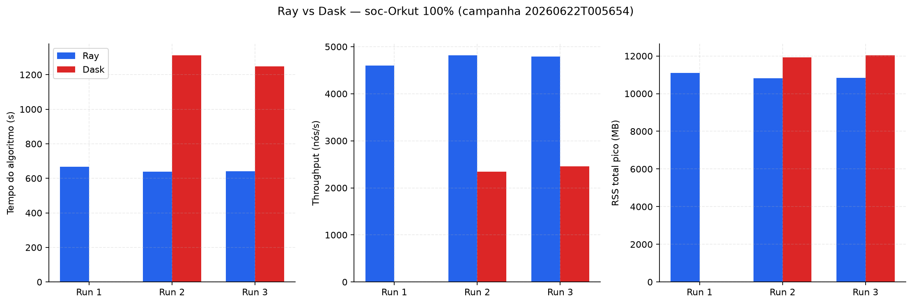
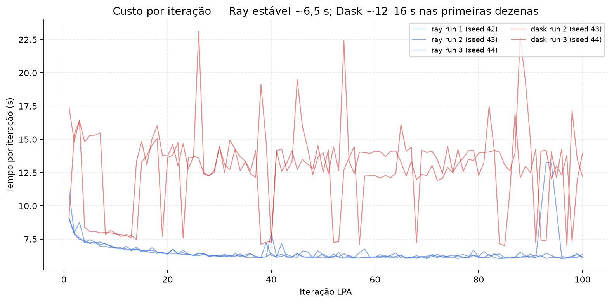
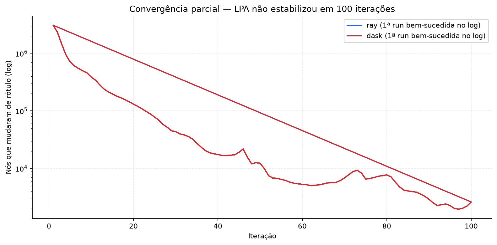
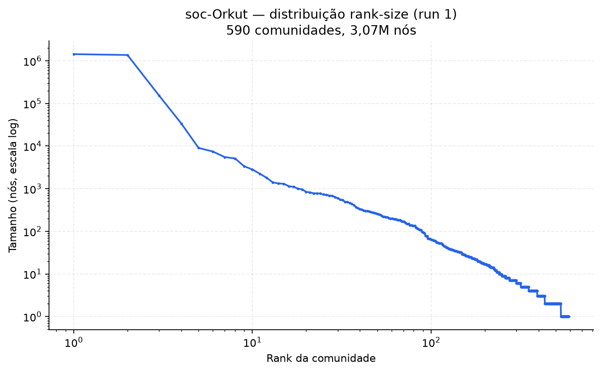
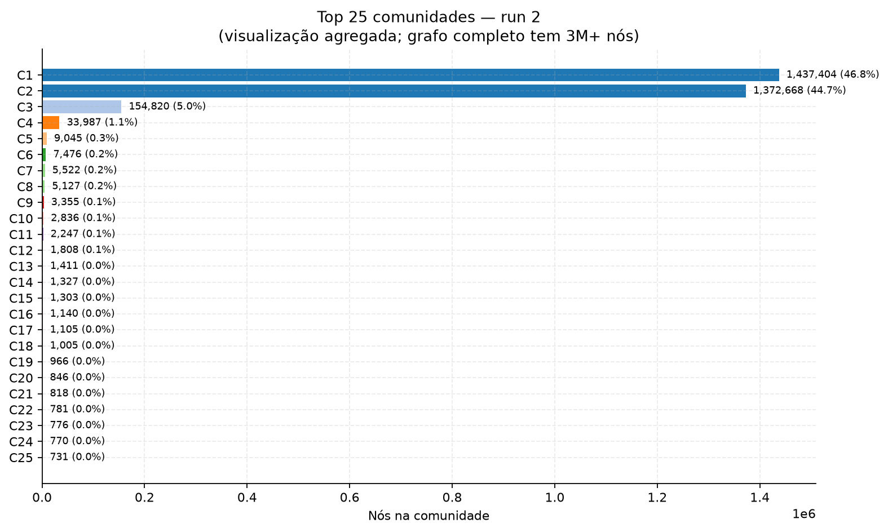
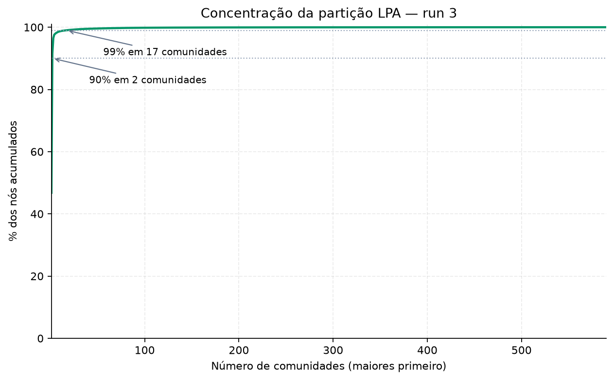

# Relatório de benchmark: Label Propagation distribuído (Ray vs Dask)

**Dataset:** soc-Orkut (SNAP, grafo não direcionado simetrizado)  
**Campanha principal:** `20260622T005654`  
**Nós:** 3 072 441 | **Iterações LPA:** 100 (máximo) | **Workers:** 6 (`lpa_chunk_divisor=6`)  
**Data dos testes:** 21–22 jun 2026

---

## 1. Resumo executivo

Comparamos duas implementações distribuídas de **Label Propagation (LPA)** sobre o grafo Orkut completo, numa VM Docker com **6 vCPUs** e cerca de **16 GB RAM**.

| Métrica | Ray (3/3 OK) | Dask (2/3 OK) | Razão Ray/Dask |
|---------|--------------|---------------|----------------|
| Tempo médio do algoritmo | **648,8 s** ± 13,3 | 1280,9 s ± 32,2 | **~2,0× mais rápido** |
| Throughput médio | **4704 nós/s** ± 96 | 2400 nós/s ± 60 | **~2,0×** |
| RSS total pico (driver+workers) | **10,9 GB** ± 0,1 | 12,0 GB ± 0,1 | **~10% menos RAM** |
| Comunidades finais | 590 | 590 (runs OK) | **idênticas** |

**Conclusão:** Ray entrega o **dobro do throughput** com **menor pressão de memória** e **100% de sucesso** na campanha. Dask completou apenas 2 de 3 runs; a run 1 falhou por **OOM do worker** (>95% do budget de ~2,6 GiB/worker) após stress de memória residual da campanha Ray anterior.

As **partições finais são byte-a-byte iguais** entre Ray runs 1–3, Dask runs 2–3 e entre abordagens — o LPA com inicialização determinística por `node_id` produz a mesma estrutura de comunidades independentemente do backend quando a execução termina com sucesso.

---

## 2. Metodologia

### 2.1 Pipeline

1. **Carga:** leitura directa do SNAP (`data/raw/soc-orkut-relationships.txt`) → CSR simétrico (~234M arcos).
2. **Particionamento:** 6 chunks (1 por worker lógico).
3. **LPA síncrono:** cada iteração propaga rótulos em paralelo; o driver faz merge antes da próxima iteração.
4. **Métricas:** tempo por iteração, RSS do process tree (driver + filhos), throughput = `nós / tempo_algo`.

### 2.2 Ambiente

| Parâmetro | Valor |
|-----------|-------|
| `lpa_max_iter` | 100 |
| `lpa_chunk_divisor` | 6 |
| `graph_directed` | false |
| Seeds | 42, 43, 44 (runs 1–3) |
| `/dev/shm` Docker | 64 MB → Ray usou `/tmp` (warning de performance) |

### 2.3 Campanhas adicionais no zip

| Stamp | Descrição |
|-------|-----------|
| `20260622T024351` | Dask isolado run 1 — **falhou** (OOM, mesmo padrão) |
| `20260622T030138` | Dask isolado run 1 — **sucesso** (1333 s algo, 590 comunidades) |

A run Dask isolada bem-sucedida confirma que o backend funciona quando a VM arranca limpa; a falha na campanha mista é consistente com **fragmentação / pressão de RAM** após Ray.

---

## 3. Análise de desempenho

### 3.1 Tempos por run (campanha principal)

| Run | Seed | Abordagem | Carga (s) | Init (s) | Algoritmo (s) | **Total (s)** | Throughput | RSS pico |
|-----|------|-----------|-----------|----------|---------------|---------------|------------|----------|
| 1 | 42 | Ray | 362,3 | 5,8 | 667,4 | 1035,6 | 4604 n/s | 11,1 GB |
| 2 | 43 | Ray | 362,3 | 4,5 | 637,4 | 1004,3 | 4820 n/s | 10,8 GB |
| 3 | 44 | Ray | 362,3 | 4,3 | 641,6 | 1008,2 | 4789 n/s | 10,8 GB |
| 1 | 42 | Dask | — | — | — | **FALHOU** | — | — |
| 2 | 43 | Dask | 366,0 | 2,9 | 1313,1 | 1682,0 | 2340 n/s | 11,9 GB |
| 3 | 44 | Dask | 366,0 | 3,2 | 1248,6 | 1617,8 | 2461 n/s | 12,0 GB |

A carga do grafo (~362–366 s) é partilhada entre runs da mesma sessão (cache quente). O tempo dominante é o **algoritmo** (~64–65% do total em Ray; ~77% em Dask).



### 3.2 Custo por iteração

Ray mantém iterações **estáveis em ~6,1–6,8 s** após as primeiras 3–5 (picos só na run 1, iter 93–94). Dask oscila entre **~7 s e ~23 s**, com as primeiras 20–30 iterações sistematicamente mais caras:

| Backend | Média/iter | Min | Max | Observação |
|---------|------------|-----|-----|------------|
| Ray run 1 | 6,67 s | 6,06 s | 13,29 s | Spike final (iter 93–94) |
| Ray run 2 | 6,37 s | 6,03 s | 9,04 s | Estável |
| Dask run 2 | 13,13 s | 7,13 s | 23,12 s | Muitas iters >10 s |
| Dask run 3 | 12,49 s | 7,01 s | 19,13 s | Idem |



**Interpretação:** ambos executam o mesmo trabalho por iteração (3M nós × vizinhança), mas Dask paga overhead extra de **scheduling**, serialização de futures e pressão de memória por worker. Ray com actors/object store (mesmo em `/tmp`) amortiza melhor o custo fixo por rodada.

### 3.3 Memória

| Métrica | Significado | Ray (média) | Dask (média, OK) |
|---------|-------------|-------------|------------------|
| `peak_process_tree_rss_mb` | Driver + todos os workers locais | **10,9 GB** | 12,0 GB |
| `peak_driver_rss_mb` | Só processo driver | 2,4 GB | 2,3 GB |
| `peak_memory_mb` | tracemalloc (heap Python driver) | ~100 MB | ~919 MB |

O pico relevante para capacity planning é **`peak_process_tree_rss_mb`**. Dask run 1 falhou quando um worker ultrapassou **95% de ~2,6 GiB** — o nanny reiniciou o processo e a future foi cancelada (`already forgotten`).

**Recomendações operacionais:**

- Docker: `shm_size: 4gb` para Ray.
- Dask: reduzir workers (`LPA_WORKERS=4`) ou aumentar RAM da VM.
- Campanhas comparativas: **reiniciar container** entre backends ou correr backends em sessões separadas.

### 3.4 Convergência

Nenhuma run atingiu `converged=true` em 100 iterações. Na run Ray 1, o número de nós que mudam de rótulo desce de 3M (iter 1) para ~5–6k (iter 90+), mas não zero:



Isto é esperado em grafos sociais grandes com LPA síncrono limitado a 100 passos — a partição ainda evolui marginalmente no final.

---

## 4. Qualidade da clusterização

### 4.1 Partição final (590 comunidades)

Todas as runs bem-sucedidas produzem **exactamente a mesma distribuição de tamanhos** — Ray e Dask convergem para a mesma estrutura quando completam.

| Estatística | Valor |
|-------------|-------|
| Comunidades | 590 |
| Maior comunidade | 1 437 404 nós (**46,8%** do grafo) |
| 2.ª maior | 1 372 668 nós (**44,7%**) |
| 3.ª maior | 154 820 nós (**5,0%**) |
| Top 10 comunidades | **98,7%** dos nós |
| Mediana | 7 nós |
| P95 | ~578 nós |
| Singletons | 58 |

A partição é **fortemente desbalanceada**: duas mega-comunidades cobrem ~91% dos nós. Isto é típico de LPA em redes sociais densas sem pós-processamento — o algoritmo tende a absorver componentes quase-conectados em super-clusters antes de estabilizar.

### 4.2 Visualização (3 runs)

Com **3,07M nós**, desenhar o grafo completo (force-directed, etc.) é **inviável e ilegível**. O baseline em visualização de grafos grandes é:

1. **Rank-size / distribuição de tamanhos** (log-log) — visão global da hierarquia de clusters.
2. **Barras ou treemap das top-K comunidades** — onde está a massa.
3. **Curva cumulativa** — quantas comunidades cobrem X% dos nós.

Os JSON de partições **não incluem `node_ids`** (>50k nós → só tamanhos), logo layout de rede só seria possível re-executando LPA numa amostra ou re-lendo o grafo completo.

Gerámos **3 conjuntos de figuras** (runs 1–3); como as partições são idênticas, os gráficos são equivalentes — mantemos os três para corresponder às 3 seeds da campanha.

**Run 1 — rank-size (log-log):**



**Run 2 — top 25 comunidades:**



**Run 3 — concentração cumulativa:**



Runs 2 e 3 têm variantes rank-size/top25/cumulative em `figures/` com o mesmo conteúdo numérico.

---

## 5. Falha Dask run 1 — post-mortem

```
Worker tcp://127.0.0.1:36381 exceeded 95% memory budget. Restarting...
lpa_iteration_chunk_tracked-... cancelled for reason: already forgotten.
```

**Causa provável:** execução imediata após 3 runs Ray (~11 GB RSS pico); workers Dask com budget default (~2,6 GiB × 6) não toleraram o pico da iter 6+. **Não indica divergência algorítmica** — runs 2–3 (e campanha isolada `030138`) completaram com partição idêntica à do Ray.

---

## 6. Conclusões

1. **Desempenho:** Ray é ~**2× mais rápido** que Dask neste workload (3M nós, 6 workers, 100 iter LPA), com menor RSS total.
2. **Robustez:** Ray 3/3; Dask 2/3 na campanha mista, 1/1 numa sessão limpa.
3. **Qualidade:** Partições **equivalentes** entre backends (590 comunidades, mesma distribuição).
4. **Clusterização:** Estrutura dominada por 2 super-comunidades; LPA não convergiu em 100 iterações — interpretar modularity/qualidade com cautela.
5. **Infra:** Aumentar `/dev/shm` e isolar runs por backend melhora repetibilidade.

---

## 7. Artefactos

| Ficheiro | Descrição |
|----------|-----------|
| `reports/metrics_raw_20260622T005654.csv` | Métricas brutas |
| `reports/benchmark_run_20260622T005654.log` | Log completo (iterações, OOM) |
| `reports/partitions_20260622T005654/*.communities.json` | Tamanhos por comunidade |
| `figures/` | Gráficos deste relatório |

**Gerado com:** `python scripts/generate_results_report.py`

---

## Referências

1. Raghavan et al. (2007). Near linear time algorithm to detect community structures. *Phys. Rev. E* 76, 036106.
2. Leskovec & Krevl (2014). SNAP Datasets — soc-Orkut. https://snap.stanford.edu/data/com-Orkut.html
3. Moritz et al. (2018). Ray. OSDI 2018.
4. Rocklin (2015). Dask. SciPy 2015.
